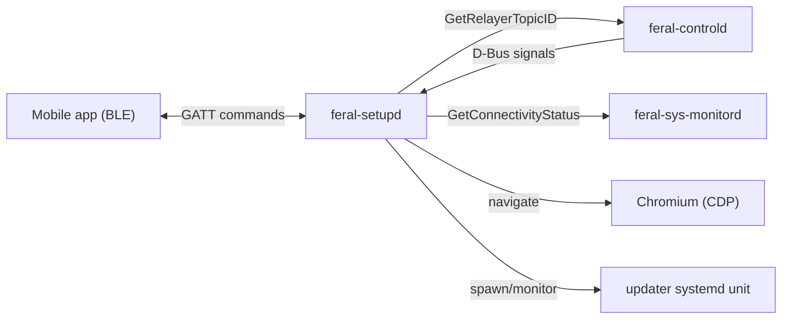
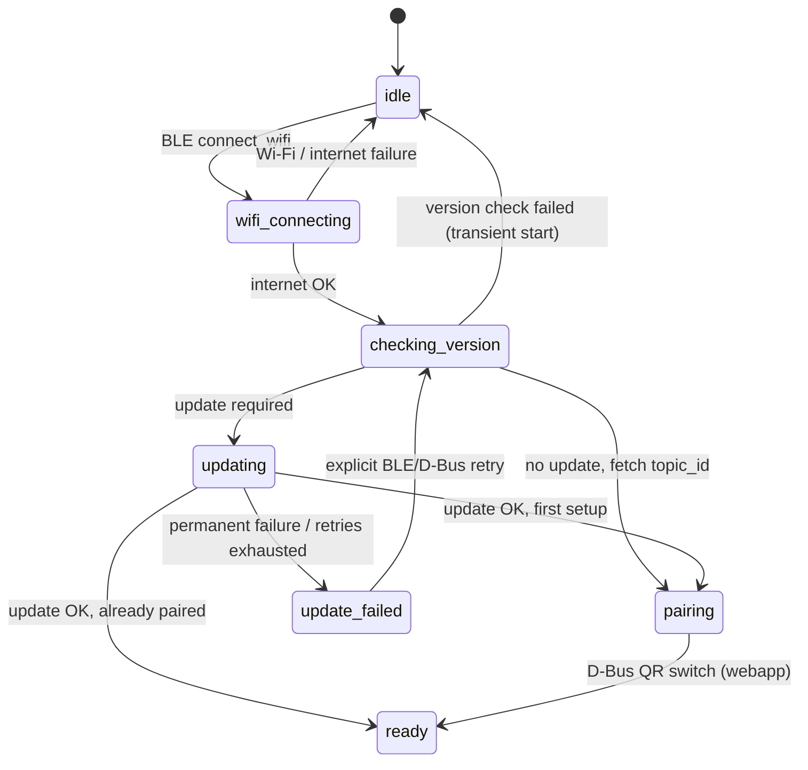
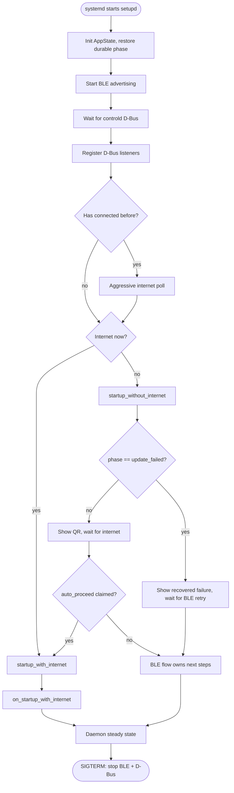
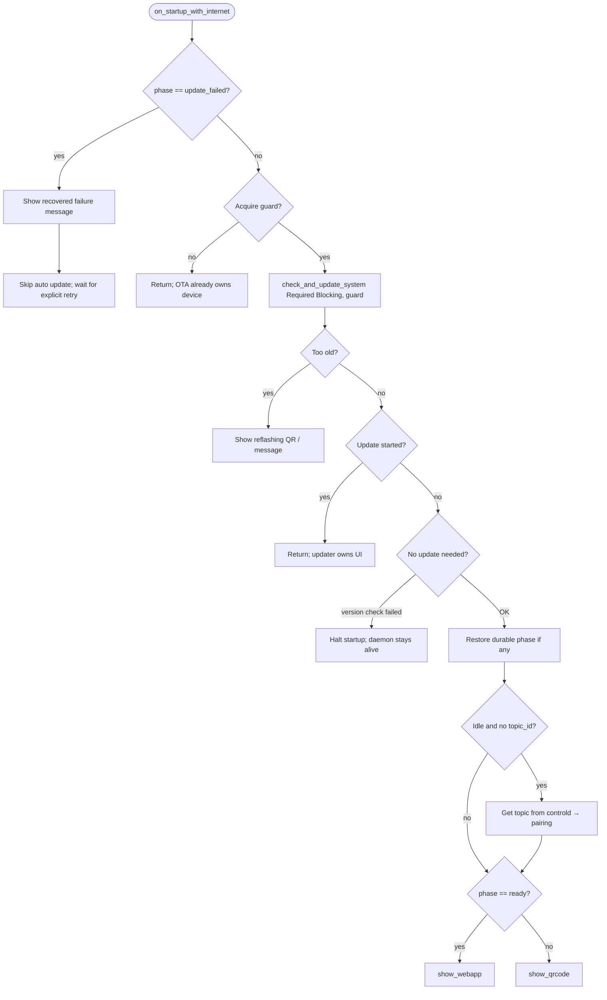
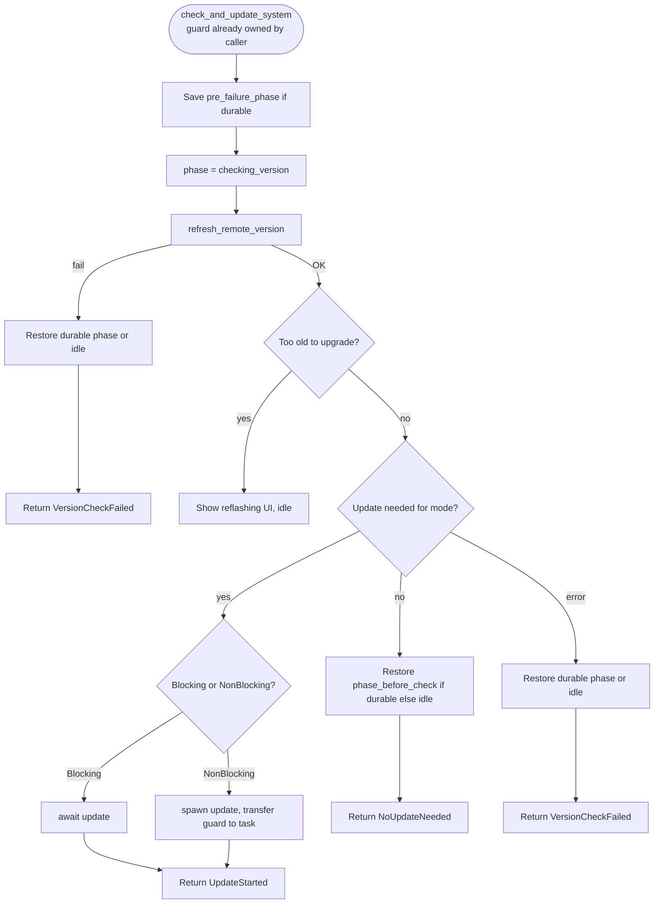
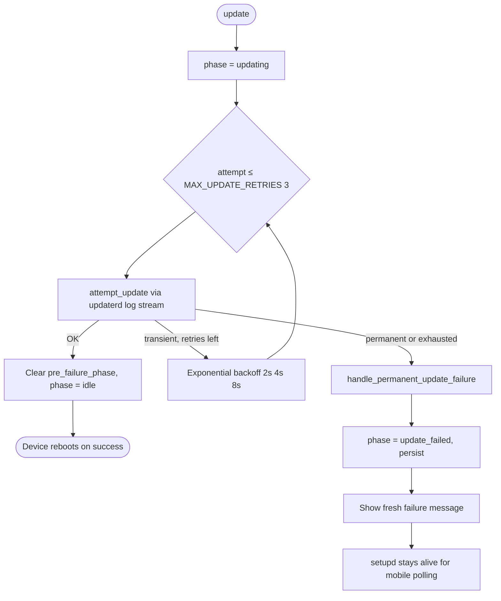
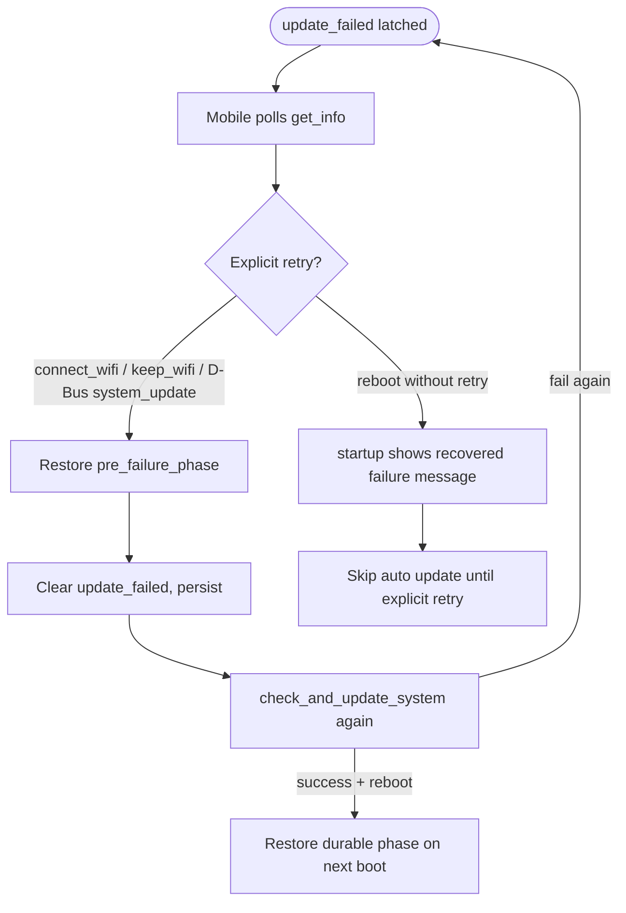

# feral-setupd Setup and Recovery Flow

This document describes how `feral-setupd` orchestrates first-run provisioning, OTA updates, pairing, and recovery. It reflects the current implementation in `components/feral-setupd/`.

For wire contracts see [`api-design.md`](api-design.md). For service boundaries see [`architecture.md`](architecture.md). For component-level notes see [`components/feral-setupd/AGENTS.md`](../components/feral-setupd/AGENTS.md).

---

## Role in the system

`feral-setupd` is the **setup and recovery UX owner**. It:

- Exposes BLE GATT commands used by the mobile app during provisioning
- Drives the TV UI through Chrome DevTools Protocol (CDP)
- Orchestrates OTA version checks and updates (retry policy lives here, not in shell scripts)
- Persists small setup flags to disk
- Listens for D-Bus signals from `feral-controld`

It does **not** connect to the relayer, route runtime commands, or make watchdog recovery decisions.



---

## The `setup_phase` state machine

Mobile polls `setup_phase` as the sixth field of the BLE `device_info` string:

```text
<device_id>|<topic_id>|<internet>|<branch>|<version>|<setup_phase>
```

The phase is the **single source of truth** for device setup progress. What setupd sets in memory is what mobile sees via `get_info` — there is no separate derived/mobile-facing layer.

### Phases

| Phase | Wire value | Durable? | Meaning |
|---|---|---|---|
| Idle | `idle` | No | No active operation |
| WiFi connecting | `wifi_connecting` | No | BLE Wi-Fi credential exchange in progress |
| Checking version | `checking_version` | No | Fetching distributor metadata / deciding if update needed |
| Updating | `updating` | No | OTA install in progress |
| Pairing | `pairing` | **Yes** | Has `topic_id`; waiting for mobile to finish pairing |
| Ready | `ready` | **Yes** | Fully paired; webapp is the normal surface |
| Update failed | `update_failed` | **Yes** | Permanent OTA failure; explicit retry required |

**Durable** phases are written to disk and restored after reboot. **Transient** phases exist only in memory; on reboot the daemon starts from restored durable state (or `idle` if none).

### State diagram (typical success path)



### Invariants

- **`pairing` requires `topic_id` on disk.** On restore, if `setup_phase=pairing` but `topic_id` is missing, phase is corrected to `idle`.
- **`ready` is set only after pairing confirmation** via the D-Bus `show_pairing_qr_code(false)` signal (QR switch to webapp). BLE Wi-Fi success transitions to `pairing`, not `ready`.
- **Legacy migration:** devices with old firmware (no `setup_phase` key) migrate as follows:
  - `paired=true` + `topic_id` → `ready` (fully paired)
  - `topic_id` only (no `paired=true`) → `pairing` (topic allocated but pairing not confirmed)
  - Neither → `idle` (fresh device)

---

## Persistence

File: `/home/feralfile/.state/setupd` (flat `key=value` lines, atomic write-temp-then-rename).

| Key | Purpose |
|---|---|
| `setup_phase` | Durable phase (`pairing`, `ready`, `update_failed`) or empty for transient |
| `topic_id` | Relayer topic ID from controld |
| `connected` | `"true"` once the device has ever reached the internet |
| `pre_failure_phase` | Durable phase captured before entering `update_failed` (`ready` or `pairing`) for recovery |

`pre_failure_phase` is written at the **start** of `check_and_update_system` (before `checking_version`), so a failure during the transient `updating` phase can still restore the prior durable state on retry.

---

## Two parallel notions of “what is on screen”

Setupd tracks UI in two ways:

1. **`app_state.page`** — the **canonical** page (QR, webapp, factory reset, failure screen, etc.). Recorded by `show_qrcode`, `show_webapp`, `show_system_upgrade`, etc.
2. **Transient progress navigations** — the blocking version-check UI paints `"Checking for updates..."` via `navigate_transient_message`, which **does not** update `app_state.page`.

After a D-Bus manual update check with `NoUpdateNeeded`, setupd must **re-show the canonical page** because Chromium may still be on the transient progress URL even though `app_state.page` is unchanged.

---

## OTA single-flight guard

`update_in_progress` (RAII `UpdateGuard`) serializes OTA attempts across BLE, startup, and D-Bus entry points.

**Guard-threading pattern:** Each mutating operation (`connect_wifi`, `keep_wifi`, `do_system_update`, `on_startup_with_internet`, `qr_switch`) acquires the `UpdateGuard` at its **entry point**, **before any side effects** (phase changes, UI navigation, Wi-Fi switching, latch mutation). This closes the TOCTOU window: if one path already holds the guard (an OTA owns the device), every other entry point fails to acquire and bails immediately. The caller then passes the owned guard down the call chain (e.g., `connect_wifi` → `internet_setup_successfully_cb` → `check_and_update_system`).

While one path holds the guard:

- Other paths **fail to acquire** and return early with no side effects
- **`connect_wifi` / `keep_wifi`** bail with `DeviceUpdating` before touching phase/UI/Wi-Fi
- **`qr_switch`** bails before navigating Chromium
- **`do_system_update`** returns early before connectivity probe or `update_failed` latch mutation
- **`on_startup_with_internet`** skips the startup update check and stays alive

Non-blocking BLE updates transfer guard ownership into a background task; the guard is released only when `update()` completes or fails.

**Important distinction:** The guard (`update_in_progress`) tracks **active OTA operations** (transient states like `checking_version`, `updating`). The durable `UpdateFailed` phase is **not** an active update — it's a persisted failure latch. So BLE `connect_wifi` / `keep_wifi` are **not** blocked in `UpdateFailed` phase; they're the intended recovery mechanism that clears the latch and restores connectivity.

---

## Daemon startup



### Case A — Startup **without** internet

1. Warm SSID cache for fast BLE scan
2. **If `setup_phase == update_failed`**, show recovered failure message and return early (skip QR/poll/auto-proceed). BLE continues advertising so mobile can retry via `connect_wifi` / `keep_wifi`, which will restore connectivity and clear the latch.
3. Otherwise, show pairing QR (`show_qrcode`)
4. Set `auto_proceed = true`
5. Poll until internet (aggressive if `connected` flag set, relaxed otherwise)
6. Persist `connected=true` on first success
7. If `auto_proceed` still true (user did not start BLE `connect_wifi`), call `on_startup_with_internet`
8. If user chose new Wi-Fi via BLE, `auto_proceed` is cleared and BLE owns the rest

`auto_proceed` uses a compare-and-swap so startup auto-advance fires at most once and cannot race a concurrent BLE `connect_wifi`.

### Case B — Startup **with** internet

1. Persist `connected=true` if first time
2. Delegate to `on_startup_with_internet`

### Case C — `on_startup_with_internet` by restored phase



| Restored phase | Startup behavior (internet OK, no mandatory update) |
|---|---|
| `idle` (no `topic_id`) | Fetch topic → `pairing` → QR |
| `pairing` | Mandatory check preserves `pairing` → QR |
| `ready` | Mandatory check preserves `ready` → webapp |
| `update_failed` | **No** auto update; recovered failure message; wait for retry |

**Note:** The `update_failed` behavior is identical for **both** online and offline boots — both show the recovered failure message and skip QR/auto-update, keeping the advertised phase and UI in sync.

---

## BLE provisioning: `connect_wifi`

```mermaid
sequenceDiagram
  participant M as Mobile
  participant B as BLE / setupd
  participant N as NetworkManager
  participant U as check_and_update_system

  M->>B: connect_wifi(ssid, pwd)
  alt Cannot acquire guard (OTA owns device)
    B-->>M: DeviceUpdating (bail before side effects)
  end
  alt UpdateFailed retry
    B->>B: Restore pre_failure_phase, persist
    B->>B: Re-save pre_failure_phase before transient state
  end
  Note over B: Guard acquired; held until response or error
  B->>B: Capture pre-connect phase
  B->>B: phase = wifi_connecting, show connecting UI
  B->>B: auto_proceed = false
  B->>N: nmcli connect
  alt Wi-Fi fail
    B->>B: phase = idle
    B-->>M: WrongWifiPassword / UnknownError
  else no internet after wait
    B->>B: phase = idle
    B-->>M: NoInternet
  else success
    B->>B: Restore captured phase before check
    B->>U: internet_setup_successfully_cb (guard passed)
    alt update started (spawned)
      Note over B,U: Guard transfers to background task
      B-->>M: DeviceUpdating
    else version check failed
      B->>B: Terminal phase (durable if was durable, else idle)
      B-->>M: VersionCheckFailed
    else no update needed
      B->>B: Restore prior phase if durable
      B->>B: If idle and no topic_id: fetch topic_id → pairing
      B-->>M: Success + topic_id
    end
  end
```

Notes:

- **Guard acquired at entry:** `connect_wifi` acquires the `UpdateGuard` before any side effects (clearing `UpdateFailed`, setting `WifiConnecting`, calling nmcli). If another path already owns the device, it bails with `DeviceUpdating` immediately. The guard is held through the entire operation and passed to `internet_setup_successfully_cb` → `check_and_update_system`.
- Mandatory update check runs **before** fetching `topic_id` and entering `pairing`
- Ready devices stay `ready` after a successful retry (not demoted to `pairing`)
- On `UpdateFailed` retry, `pre_failure_phase` is restored and re-saved before transient states so a second failure can still recover
- On version-check failure or general error after `UpdateFailed` retry, the wrapper uses **terminal phase logic**: preserve durable phases (`ready`, `pairing`), collapse transient phases (`checking_version`, etc.) to `idle`. This prevents demoting a device that just recovered from `update_failed` via a BLE retry.
- **Phase capture/restore around `WifiConnecting`:** `connect_wifi` captures the pre-connect durable phase (Ready/Pairing) before entering the transient `WifiConnecting`, then restores it before the update check. This ensures `check_and_update_system`'s no-update restoration snapshots the true durable phase instead of the transient one, preventing a Ready device from being demoted to Pairing after a successful retry.

### Case — `keep_wifi`

Same update-failure retry clearing as `connect_wifi`, but skips nmcli (keeps current Wi-Fi) and does **not** set `WifiConnecting` before the check. Acquires the `UpdateGuard` at entry; bails with `DeviceUpdating` before any side effects if another path already owns the device. Requires internet before proceeding. Because it never enters `WifiConnecting`, its phase snapshot is always the restored durable phase and doesn't need the explicit capture/restore that `connect_wifi` requires.

---

## Update check: `check_and_update_system`

Shared by startup, BLE, and D-Bus paths.



| Parameter | Startup | BLE setup | D-Bus manual |
|---|---|---|---|
| `UpdateMode` | `Required` (mandatory only) | `Required` | `Available` (any newer) |
| `UpdateExecution` | `Blocking` | `NonBlocking` | `Blocking` |

**Phase preservation:** `phase_before_check` is captured before entering `checking_version`. On `NoUpdateNeeded` or version-check failure, durable phases (`ready`, `pairing`) are restored instead of demoting to `idle`.

**Progress UI:** only `Blocking` execution drives transient `"Checking for updates..."` TV copy. BLE uses a single HTTP retry budget so the mobile response is not blocked for ~34s.

---

## Update execution: `update()`



- **Transient errors** (network, lock held, updater infra): retry up to 3 attempts with exponential backoff
- **Permanent errors** (signature, corrupt image, disk/snapshot failure): no retry; latch `update_failed`
- Error classification uses **exact string matching** on updater script messages (see `classify_updater_message`); companion `ffos` script output must stay aligned

On success, `pre_failure_phase` is cleared so a later failure from a non-durable start cannot restore a stale `ready`/`pairing`.

---

## Update failure recovery



**Fresh failure** (same session): `UPDATE_FAILED_FRESH_MSG` — suggests restart or phone retry.

**Reboot recovery** (phase restored from disk): `UPDATE_FAILED_RECOVERED_MSG` — user already restarted; guide to phone retry. This message is shown on **both** online and offline boots in `UpdateFailed` phase, so the device never shows QR while still advertising `setup_phase=update_failed`. BLE continues advertising so mobile can initiate `connect_wifi` / `keep_wifi` retry, which will restore connectivity and clear the latch.

Explicit retry entry points:

| Entry | Clears `update_failed` | Restores `pre_failure_phase` |
|---|---|---|
| BLE `connect_wifi` | Yes | Yes |
| BLE `keep_wifi` | Yes | Yes |
| D-Bus `system_update` | Yes | Yes |

If persist fails during retry clear, BLE paths abort; D-Bus path returns early (disk still says `update_failed` until a successful persist).

---

## D-Bus `system_update` (manual / optional update)

```mermaid
flowchart TD
  Sig([controld emits system_update]) --> Guard{Acquire guard?}
  Guard -->|no| Reject[Return early: OTA already owns device]
  Guard -->|yes| Online{Internet?}
  Note over Online: Guard held from here through check
  Online -->|no| Msg[Show no-internet message]
  Online -->|yes| Clear{update_failed?}
  Clear -->|yes| Restore[Restore pre_failure_phase, persist]
  Clear -->|no| Check
  Restore --> Check[check_and_update_system Available Blocking, guard]
  Check --> Result{Result}
  Result -->|UpdateStarted / TooOld / VersionCheckFailed| NoOp[Core already drove final UI]
  Result -->|NoUpdateNeeded| RestorePage[Re-show canonical page]
  RestorePage --> Stale{page == SystemUpgrade?}
  Stale -->|yes stale failure screen| PhaseNav[webapp if ready else QR]
  Stale -->|no| Canon[Re-navigate current canonical page]
  Canon --> WebApp[WebApp → show_webapp]
  Canon --> QR[QRCode → show_qrcode]
  Canon --> Msg2[Message → show_message]
  Canon --> Factory[FactoryReset → show_factory_reset]
```

The `NoUpdateNeeded` follow-up exists because blocking progress UI leaves Chromium on a transient URL. `restore_page_target()` maps the canonical page back to the correct CDP navigation.

**Guard acquisition at entry:** `do_system_update` acquires the `UpdateGuard` at its entry point, **before** probing connectivity or mutating the `update_failed` latch. If another path already owns the device (guard acquisition fails), it returns immediately with no side effects. The owned guard is then passed through to `check_and_update_system`, serializing the entire manual retry against OTA.

---

## Pairing confirmation (D-Bus QR switch)

When mobile completes pairing, controld emits `show_pairing_qr_code(false)`:

1. Acquire `UpdateGuard`; bail before navigation if another path already owns the device
2. If `update_failed` phase is latched, bail (stay on failure surface until explicit retry)
3. If current phase is `pairing` → set `ready`, persist
4. `show_webapp`

The inverse signal (`true`) shows the setup QR via `show_qrcode`, which resets transient phases (`wifi_connecting`, `checking_version`, `updating`) to `idle` but **preserves** durable phases (`pairing`, `ready`, `update_failed`).

---

## Bluetooth disconnect behavior

On BLE disconnect, if the canonical page is **not** one of `{webapp, system_upgrade, factory_reset, reflashing_required}`, setupd shows QR again. During a blocking version check, `app_state.page` still reflects the real prior surface (progress UI is transient), so a mid-check disconnect does not incorrectly drop a settled webapp to QR.

---

## `get_info` during active update

When `setup_phase` is `checking_version` or `updating`, `get_info` triggers a **background** connectivity refresh (`trigger_refresh_async`) so the BLE response is not blocked on a 7s D-Bus timeout. Fresh `internet` appears on the next poll.

---

## Quick reference: who drives what

| Concern | Owner |
|---|---|
| `setup_phase` truth | `SetupLifecycle` in setupd |
| Relayer topic | controld (setupd reads via D-Bus) |
| Internet reachability | sys-monitord (cached in setupd `Connectivity`) |
| OTA download/install | updater scripts + updaterd (setupd orchestrates) |
| TV page navigation | setupd via CDP |
| Pairing completion signal | controld → setupd D-Bus QR switch |
| Recovery policy (restart/reboot) | watchdog (not setupd) |

---

## Related documents

- [`api-design.md`](api-design.md) — BLE `device_info` format and D-Bus signal registry
- [`architecture.md`](architecture.md) — service boundaries and persistence table
- [`components/feral-setupd/AGENTS.md`](../components/feral-setupd/AGENTS.md) — component contracts and verification commands
