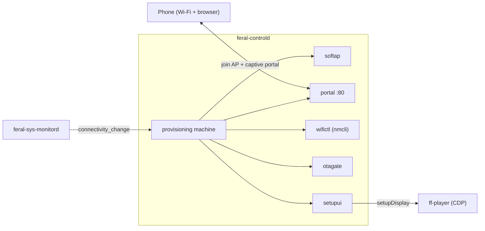
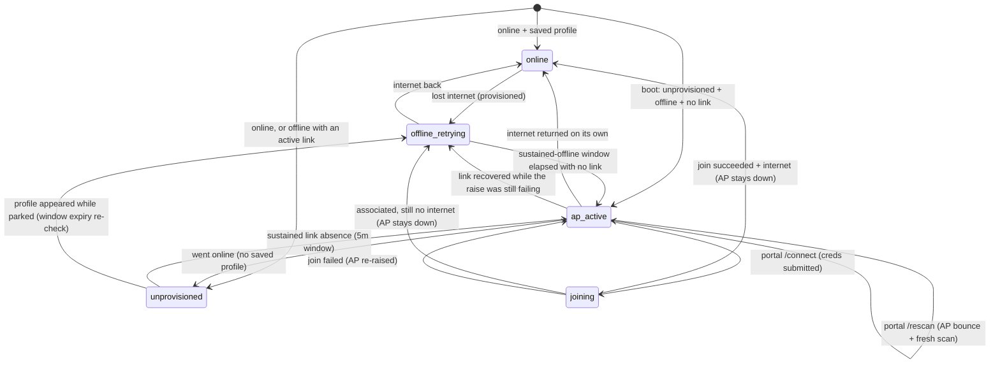

# Device Setup and Recovery Flow

This document describes how `feral-controld` takes a device from cold boot through Wi-Fi provisioning, the OTA gate, claiming, and steady-state playback — and how it re-enters provisioning to recover a device that falls offline. Since the setupd merge, this whole flow lives inside `feral-controld`; there is no separate setup daemon and no BLE channel.

For wire contracts see [`api-design.md`](api-design.md). For service boundaries and the merge rationale see [`architecture.md`](architecture.md). For component-level notes see [`components/feral-controld/AGENTS.md`](../components/feral-controld/AGENTS.md).

---

## Ownership

The setup domain is a set of sub-packages inside `feral-controld`:

| Concern | Package |
|---|---|
| Wi-Fi hotspot (raise/lower) | `softap` |
| Captive portal (HTTP) | `portal` |
| AP trigger + join state machine | `provisioning` |
| `nmcli` scan / join / saved profiles | `wifictl` |
| OTA gate (single-flight, retry, latch) | `otagate` |
| On-screen narration (CDP → ff-player) | `setupui` |
| Claim QR, factory reset, log upload | `devicectl` |

The relayer, `commandrouter`, and CDP forwarding are the runtime side of the same daemon and come up *after* the setup domain.

---

## On-screen narration states (`setupui`)

`setupui` pushes setup progress to the bundled player over the `setupDisplay` CDP contract (manifest-gated, fire-and-forget — see [`architecture.md`](architecture.md)). The states are:

| State | Shown when |
|---|---|
| `scanning` | The pre-AP Wi-Fi scan is running (extension state; players that predate it render nothing). Shown before the first AP raise and during a portal-requested rescan bounce. |
| `softap_qr` | AP is up; the phone should join `FF1-<device_id>` and open the portal. Carries SSID and PSK. |
| `joining` | Credentials submitted; the device is joining the chosen network. |
| `finalizing` | Extension state covering the gap between a successful join and the claim step (relayer-topic wait + pre-claim OTA version check and its retries). Cleared (`hidden`) if the flow gives up so a stale "preparing" never lingers. |
| `join_failed` | Join failed (wrong password / not found / timeout); AP is being re-raised for a retry. Carries a reason. Also reused by the pre-claim OTA flow when an update ladder fails (fixed prose reason, no AP re-raise — the player-owned title is the open half of F-12; see the narrator-policy bullet below). |
| `updating` | OTA install in progress. Carries progress. |
| `claim_qr` | Provisioned and up to date; showing the claim step. Carries the `device_connect` URL plus optional `device_name` (the mDNS-advertised name, e.g. `FF1-8EVTK3RE`). The player presents app auto-discovery as the PRIMARY path — open the app on the same Wi-Fi and it finds the frame via `_ff1._tcp` — with the QR as the backup for when discovery fails. Painted automatically when an unclaimed device comes online (`MaybeShowClaimQROnOnline`, the launcher-ui replacement — the relayer `showPairingQRCode` command cannot start a first-time claim because the app only connects after this step), and again on demand via that relayer command. The auto-trigger waits for the relayer topic and runs the same mandatory pre-claim OTA gate. |
| `ready` | Pairing confirmed; the player owns the screen. |
| `hidden` | Overlay hidden; normal artwork playback. |
| `factory_reset` | Factory reset staged (extension state, best-effort before reboot). |

There is no durable `setup_phase` state file; these are transient narration intents. The live setup state a LAN client can read is the `provisioning` machine state, exposed as `setup_state` on `GET /api/status`.

---

## The `provisioning` state machine

Machine states: `starting` (pre-assessment sentinel, held only until the boot connectivity assessment resolves — it exists so the first resolved state always notifies, which the auto claim trigger depends on), `online`, `offline_retrying`, `unprovisioned`, `ap_active`, `joining`. Transitions are driven by connectivity/link signals from `feral-sys-monitord` (`connectivity_change`) and by portal credential submits.

**Trigger rules:**

- **Unprovisioned + offline + confirmed no link → raise the AP immediately at the boot assessment**: a fresh device with no saved Wi-Fi and no ethernet needs the AP right away. Every confirmed link loss *after* boot gets the same 5-minute continuous-confirmed-absence window as the provisioned flavor, however it arrives: as the connectivity edge itself (an online wired frame whose LAN switch reboots for 20 seconds must not flash setup over its artwork), noticed by the 15s tick probe on a parked device (a cable unplug emits no connectivity edge — the device is already offline), or riding in on a redundant offline re-emission (a `feral-sys-monitord` restart re-emits its first probe unconditionally; such a reading counts as one confirmed absence, never an immediate raise). The window matters because once the AP is up, only going online or a portal join lowers it: there is deliberately no link-based exit from a *raised* `ap_active`, since a "link returned" reading cannot be trusted under every wiring while the hotspot may be what the probe sees. A *failed* raise — `ap_active` with no hotspot actually up — is the one flavor a confirmed link-present reading (from an assessment or a tick probe) may exit, back to `offline_retrying` or `unprovisioned` by saved profile: the link can genuinely recover while NetworkManager keeps refusing the raise, and on an air-gapped LAN no connectivity event would ever arrive, so without that exit a late successful retry would drop the recovered link. With no link guard wired there is nothing to confirm absence over time, so the immediate raise keeps its original scope.
- **Provisioned + offline → arm a sustained link-loss window** (`defaultOfflineWindow = 5m`, probed on a `15s` tick). Any tick that sees a link — or gets an inconclusive probe — disarms the window; the clock restarts at the next confirmed absence, so the AP raises only after a full window of **continuous, confirmed link absence**. The window deliberately does not measure time-since-internet-loss — at neither end: it is armed by the *first confirmed-absent probe*, not by the offline reading that preceded it (arming at the reading would let the AP raise after 4m45s of confirmed absence, one tick short), and an association lost moments before an internet-loss deadline still gets its full 5 minutes (a router reboot mid-outage never pops the AP over active artwork). With no link guard wired at all there is nothing to confirm, so the window keeps its original "5m from the offline event" baseline.
- **Any live local link suppresses the AP** — a wired (ethernet) link or an associated Wi-Fi station — even when the device reports offline. The AP raises on **link loss, not internet loss**: it can only fix "cannot associate" (re-submitting credentials for a network the device is already on just rejoins the same dead network), and the cases it genuinely rescues — a changed Wi-Fi password, a vanished SSID — present as link *down*, not up-but-offline. Raising over a live Wi-Fi association would also drop the station link on the single radio, killing LAN hub control and mDNS on an otherwise healthy LAN (ISP outage, air-gapped gallery) — and on Wi-Fi the raise is a one-way door: the hotspot takes the radio, so reachability can never return on its own to tear the AP down.
- **The device's own setup hotspot never counts as a link.** The probe (`status.LinkChecker.ExternalLink`) excludes the `ff1-softap` NM profile by name — which also covers a leftover hotspot from a failed teardown — and the machine additionally ignores the guard while it knows its own AP is up.
- **A failed link probe defers the AP, never authorizes it.** `nmcli` errors/timeouts read as *unknown*; only a probe that positively confirms "no link" can count toward a raise. Deferring costs one 15s tick; a false "no link" would cost a healthy association.
- **A redundant *offline* reading never tears the AP down.** While the hotspot holds the radio the device is offline by definition, so an offline reading arriving in `ap_active` carries no information — and readings do arrive (a `feral-sys-monitord` restart re-emits its first probe unconditionally; the assumed-offline boot re-query feeds one in). Both the provisioned and unprovisioned branches keep `ap_active` and merely reconcile, so a portal is never pulled out from under a phone mid-setup — which on the provisioned path would additionally cost another full 5-minute window before setup came back.
- **Any return to online tears the AP down.**

---

## Cold boot → provisioning → join

### Startup ordering

`feral-controld` brings the LAN hub, mDNS, and the provisioning domain up **before** the relayer/CDP init, and never lets a relayer or CDP failure abort setup (see [`architecture.md`](architecture.md), "The setupd merge"). On a fresh or offline device this means the AP path is available almost immediately, independent of any cloud reachability.

### The AP and captive portal

When the machine enters `ap_active`:

1. `wifictl.RefreshScanCache` runs a live scan **before** the AP goes up (the single radio can't scan and host at once), caching SSIDs for the portal's picker.
2. `softap.Up` raises the NetworkManager hotspot: SSID `FF1-<device_id>`, WPA2-PSK a deterministic 8-digit numeric code derived from the device id (first 4 bytes of SHA-256, reduced mod 10⁸, zero-padded — see [`api-design.md`](api-design.md), "The access point"). NM runs DHCP/NAT.
3. The portal starts on `:80`. `setupui` narrates `softap_qr` with the SSID and PSK so the TV shows a join QR.

The phone joins the AP and its OS issues a captive-portal probe (`/generate_204`, `/hotspot-detect.html`, etc.). The portal answers every probe with a `302` to `/` (rather than the 204/success body the OS expects), which makes the OS pop the captive-portal page. The picker lists the cached SSIDs (or a manual SSID field if the scan was empty).

### Join and the AP bounce

On `POST /connect` with `ssid` + `password`, the provisioning machine:

1. Enters `joining`; `setupui` narrates `joining`.
2. Tears the AP **down** (single radio), then runs `wifictl.Join` (`nmcli device wifi connect`).
3. **On success:** the association succeeded and the AP stays down; the portal reports `/status` → `succeeded` either way. The machine then re-assesses reachability rather than assuming it: if the joined network has internet, it transitions to `online` and setup proceeds to the OTA gate and claim QR; if the network is associated but has no upstream (air-gapped LAN, dead WAN), it parks in `offline_retrying` with the AP down — association is not reachability.
4. **On failure (any class, including wrong password):** re-raises the AP so the user can retry. `wifictl` classifies the failure as auth / SSID-not-found / timeout / unknown; the portal `/status` returns `failed` with that reason, and `setupui` narrates `join_failed` before the AP-up narration re-renders `softap_qr`.

This tear-down-then-rejoin, with a re-raise on failure, is the "AP bounce" the phone experiences: it may briefly lose the AP during the join attempt and re-associate afterward if the join failed.

---

## OTA gate

Once the device is online (whether just provisioned, or booted with a saved profile), setup runs through `otagate` before showing the claim QR.

- **Single-flight** across all entry points via one key (`"ota"`); concurrent callers coalesce onto the in-flight update.
  - `EnsureLatestBeforeClaim` (mode `Required`) is the mandatory pre-claim gate: it updates only if a mandatory/minimum version demands it.
  - `EnsureLatestAtStartup` (mode `Required`) is the boot-time gate for a device that is **already settled** (claimed or pairing-confirmed) — the restored Ready-phase leg of setupd's every-boot check. Triggered by the provisioning machine's `→online`/`→unprovisioned` transitions (`MaybeRunStartupOTAGateOnOnline`), it runs once per process lifetime; a `VersionCheckFailed` outcome retries with the auto-claim backoff (30s doubling to 5m) up to a bounded attempt budget (8 attempts, ~22m of backoff), after which the boot check gives up and the nightly updater timer is the fallback. Only a ctx-aborted retry leaves the once-latch clear for the next online transition. Without this gate, a force release (`min_runtime_version` above the running build) waits for the nightly updater timer — many hours after the reboot an operator performed expecting the update.
    - This gate is wired only when the daemon started within the kernel boot window (a `Restart=always` mid-exhibition crash-restart must not spring a required update on a healthy playing device), and is additionally gated **at entry** on its own `startupOTAGateEntryWindow` — deliberately wider than the boot player-recovery window below, because WAN routinely trails boot by several minutes on a site-wide power restore, which is exactly the boot this gate most needs to cover. The window is checked once, at entry only; a gate that started inside it may keep retrying a failing version check past it (boot-time DNS convergence is the common cause). Claim state is re-checked on every retry (not just at entry), so a factory reset landing mid-backoff stops the loop instead of running a required update against a now-unclaimed device.
  - `RequestUpdate` (mode `Available`) is the user-triggered `updateToLatestVersion` command: update to any newer version.
- **Always local:** the gate starts the updater systemd unit on-device and tails its log. There is no remote/BLE-triggered path.
- **Version-check ladder:** 3 attempts, fixed 2s wait, 10s per-request cap; a failed check returns `VersionCheckFailed` and does not latch.
- **Update-spawn ladder:** up to 3 attempts, `2^attempt`-second backoff (2s, 4s); a permanent failure (or a transient failure on the last attempt) latches an in-memory permanent-failure state and fires `OnPermanentFailure`. An explicit retry clears the latch. Transient vs. permanent comes from exact-string matching on the `ffos` updater messages. The latch therefore records ladder **exhaustion**, not the classifier verdict — three transient download failures latch exactly like a bad signature.
- **Pre-claim retry cadence (F-12):** the auto-claim loop reads that latch (freshness-keyed to the round's start) to pick its backoff: rounds that only failed the cheap way (version check, ctx cancel) retry on 30s→5m doubling; rounds that burned a full download ladder retry on a stretched cadence escalating 1h→24h. An online transition or topic assignment that arrives while the loop is parked shortens the stretched wait to at most 5 minutes (the wake floor); pokes during the gate run itself are dropped, so flapping links cannot run ladders back-to-back. The loop never goes terminal — unlike the startup gate it has no nightly-timer fallback. See `api-design.md` for the full contract.
- **Narrator policy is gate-level, claim-primary, Mode-secondary:** all three entry points share one gate and one `OnPermanentFailure` callback, and the policy is decided at emit time by reading the LIVE claim state — a settled-device `EnsureLatestAtStartup` joining an in-flight update another (pre-claim) caller started still gets the settled policy, not the pre-claim one. Claim not settled: today's pairing-flow behavior (`join_failed` narration). Claim settled: there is no "join" to fail, so the callback hides a stuck `updating` overlay (`HideIfShowing`) and logs, instead of repainting `join_failed` over a claimed device. A separate post-ladder watchdog (`OnUpdateSucceededNoReboot`, default 5 minutes) hides a stuck `updating` overlay if a successful ladder's expected reboot never happens. See [`api-design.md`](api-design.md) for the full contract.

While an update runs, `setupui` narrates `updating`. A successful update reboots the device, which re-enters this flow from cold boot.

---

## Claim QR → ready

Claiming is driven by the `showPairingQRCode` command:

- **`show=true`:** runs `EnsureLatestBeforeClaim`. Only on `no-update-needed` does it paint the claim QR via `setupui.ShowClaimQR`. If an update starts, the device is too old, or the version check fails, the QR is **withheld** (the narration reflects the update path instead).
- The QR encodes `https://link.feralfile.com/device_connect/<device_id>|<topic_id>|<internet>|<branch>|<version>|pairing` — a pipe-delimited string kept byte-identical to the pre-merge format (see [`api-design.md`](api-design.md)).
- The phone scans it and binds the topic to the user's account via the cloud.
- **`show=false`** (cloud signals pairing ended): `setupui.ShowReady()` is recorded **before** `Hide()`. Pairing confirmation is a durable, one-shot event, so `ready` must register even if the hide is interrupted — hiding first would risk stranding the device in a pairing state while the cloud believes pairing succeeded.

After `ready`/`hidden`, the bundled player owns the screen and normal artwork playback continues.

---

## Boot player recovery

Separately from provisioning, `feral-controld` runs a bounded recovery state machine (`Idle → Armed → Attempting → Succeeded | Deferred → Attempting | Expired | Exhausted`, `devicectl/boot_recovery.go`) for the case where the kiosk paints the player before Wi-Fi association completes and its network fetches die without retry — the kiosk deliberately does not gate boot on the network (a blocked kiosk is a black screen). It is wired only within the kernel boot window and fires on the boot's first WAN-confirmed online transition; it classifies the player's structured status (`window.__ffosPlayerStatus`) and, only when that proves the page is genuinely dead, escalates to `playersession.Session.NavigateHome` (navigate-to-entry, never reload-in-place) instead of an in-place refresh. See [`architecture.md`](architecture.md), "Kiosk and Daemon Logic Ownership", for the full state table and classification rules.

---

## Offline recovery

A claimed, provisioned device that later loses internet does **not** immediately show the AP. It enters `offline_retrying`, where every 15s tick probes the local link: any sighting (or inconclusive probe) disarms the window, and the clock restarts at the next confirmed absence. If internet returns, it goes back to `online` with no visible change. Only after a full window (5m) of **continuous, confirmed link absence** (no ethernet, no Wi-Fi association) does it raise the AP with reason `sustained-offline` — the same portal path as first-run provisioning — so the owner can re-enter Wi-Fi credentials. A device whose Wi-Fi association survives (WAN outage, air-gapped LAN) stays in `offline_retrying` indefinitely with the AP down: it keeps its station link, stays reachable on the LAN hub, and keeps advertising mDNS. Moving such a frame to a new Wi-Fi while the old network is still associated has no over-the-LAN credential path today (the hub's `connect` command is the claim/pairing step, not a Wi-Fi join; an over-the-hub Wi-Fi change is a possible follow-up) — the recovery is physical: power off or unplug the old router so the association drops, which raises the AP after a fresh sustained window. The LAN hub listener stays bound throughout (only mDNS discoverability is link-keyed; the listener itself is unconditional), so a LAN client can still reach the device on a working local link even with no internet.

---

## Factory reset

Factory reset (`factoryReset` command) is a security-relevant special case handled in `devicectl`:

1. `feral-controld` clears the persisted relayer topic in-process (`clearPersistedRelayerTopic`), best-effort.
2. It starts `set-factory-boot.service` via `systemctl`, which stages a one-shot boot into the pristine factory btrfs snapshot and reboots.
3. `setupui` narrates `factory_reset` best-effort before the reboot.

The reset **abandons** the running subvolume rather than wiping it: the pristine snapshot becomes the boot target, and the old subvolume (with its now-cleared topic) is left behind. Clearing the topic first closes the window where a resold or interrupted device could remain commandable on the old topic before the reboot completes. On next boot the device comes up fresh and re-enters this flow from cold boot.

---

## Log upload

The `uploadLogs` command zips the device logs and uploads them via a presigned POST to `https://support-logs.feralfile.com/v2/ff1/log-submissions` (which returns a presigned URL), then a PUT of the zip to S3. An optional `supportBundleID` joins FF1 evidence into a support bundle.

---

## Related documents

- [`api-design.md`](api-design.md) — portal endpoints, LAN hub surface, claim QR format, OTA gate contract
- [`architecture.md`](architecture.md) — service boundaries, the setupd merge rationale, the open-LAN surface
- [`components/feral-controld/AGENTS.md`](../components/feral-controld/AGENTS.md) — component contracts and verification commands
