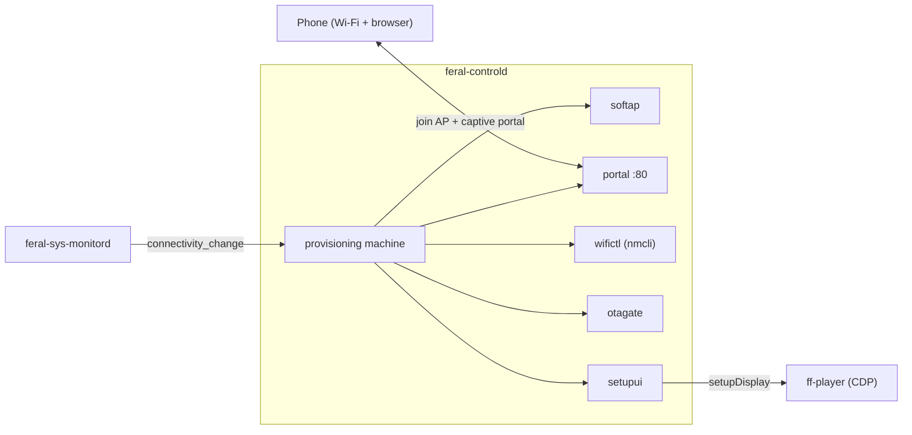

# Device Setup and Recovery Flow

This document describes how `feral-controld` takes a device from cold boot through Wi-Fi provisioning, the OTA gate, claiming, and steady-state playback — and how it re-enters provisioning to recover a device that falls offline. Since the setupd merge, this whole flow lives inside `feral-controld`; there is no separate setup daemon and no BLE channel.

For wire contracts see [`api-design.md`](api-design.md). For service boundaries and the merge rationale see [`architecture.md`](architecture.md). For component-level notes see [`components/feral-controld/AGENTS.md`](../components/feral-controld/AGENTS.md).

---

## Ownership

The setup domain is a set of sub-packages inside `feral-controld`:

| Concern | Package |
|---|---|
| Wi-Fi hotspot (raise/lower) | `softap` |
| Captive portal (HTTP) | `portal` |
| AP trigger + join state machine | `provisioning` |
| `nmcli` scan / join / saved profiles | `wifictl` |
| OTA gate (single-flight, retry, latch) | `otagate` |
| On-screen narration (CDP → ff-player) | `setupui` |
| Claim QR, factory reset, log upload | `devicectl` |

The relayer, `commandrouter`, and CDP forwarding are the runtime side of the same daemon and come up *after* the setup domain.



---

## On-screen narration states (`setupui`)

`setupui` pushes setup progress to the bundled player over the `setupDisplay` CDP contract (manifest-gated, fire-and-forget — see [`architecture.md`](architecture.md)). The states are:

| State | Shown when |
|---|---|
| `scanning` | The pre-AP Wi-Fi scan is running (extension state; players that predate it render nothing). Shown before the first AP raise and during a portal-requested rescan bounce. |
| `softap_qr` | AP is up; the phone should join `FF1-<device_id>` and open the portal. Carries SSID and PSK. |
| `joining` | Credentials submitted; the device is joining the chosen network. |
| `finalizing` | Extension state covering the gap between a successful join and the claim step (relayer-topic wait + pre-claim OTA version check and its retries). Cleared (`hidden`) if the flow gives up so a stale "preparing" never lingers. |
| `join_failed` | Two uses share this state. (1) Its namesake: a join failed (wrong password / not found / timeout) and the AP is being re-raised for a retry — carries a reason. (2) The pre-claim OTA flow when an update ladder fails (fixed prose reason, no AP re-raise — see the narrator-policy bullet below). The player-owned "Couldn't connect to Wi-Fi" **title** is still wrong for use (2) — the remaining open sliver of F-12. |
| `connecting` | The `offline_retrying` narrations (M-0/M-1), painted with the AP **down**: the boot-offline entry ("looking for your Wi-Fi network…", "connected but no internet", or the hedged "checking…") and the joined-but-no-internet edges. The machine's `Message` carries the semantics as the `reason` body, and the tick keeps the boot wording truthful as the link comes and goes (a sighted link replaces the setup promise with the no-internet wording; an unknown probe swaps in the hedge; a confirmed-lost link restores the promise). The player title is deliberately neutral ("Connecting to the network"): on a NORMAL reboot this narration is on screen for the ~1s between CDP connect and the first online confirmation, and the previously borrowed `join_failed` title flashed a false "Couldn't connect to Wi-Fi" on every boot (the title-assertion half of F-12, now closed — the brief neutral paint itself still occurs on a normal reboot, since `Resync` fires in that gap; debouncing the boot narration remains a possible follow-up). Extension state: `setupui.ShowConnecting` downgrades to `join_failed` on player manifests that predate it, so the offline narration never silently disappears on an older bundle. |
| `updating` | OTA install in progress. Carries progress. |
| `claim_qr` | Provisioned and up to date; showing the claim step. Carries the `device_connect` URL plus optional `device_name` (the mDNS-advertised name, e.g. `FF1-8EVTK3RE`). The player presents app auto-discovery as the PRIMARY path — open the app on the same Wi-Fi and it finds the frame via `_ff1._tcp` — with the QR as the backup for when discovery fails. Painted automatically when an unclaimed device comes online (`MaybeShowClaimQROnOnline`, the launcher-ui replacement — the relayer `showPairingQRCode` command cannot start a first-time claim because the app only connects after this step), and again on demand via that relayer command. The auto-trigger waits for the relayer topic and runs the same mandatory pre-claim OTA gate. |
| `ready` | Pairing confirmed; the player owns the screen. |
| `setup_error` | Extension state for the §4.6 escalation latches: a persistent AP raise (`ap_start_failed`) or teardown (`ap_release_failed`) failure the machine cannot resolve — 8 consecutive failures (~2 min) latch it once, retries continue underneath, and the latch suppresses the per-retry `scanning` push so the panel does not flap. `reason` carries the prose (connecting convention), including the device identity. Send-time downgrade to `join_failed` on manifests that predate it (shared fallback table with `connecting`); cleared by the successful raise's own `softap_qr` repaint, or by an explicit narrated hide when the wedge resolves in a resting state. |
| `hidden` | Overlay hidden; normal artwork playback. |
| `factory_reset` | Factory reset staged (extension state, best-effort before reboot). |

There is no durable `setup_phase` state file; these are transient narration intents. The live setup state a LAN client can read is the `provisioning` machine state, exposed as `setup_state` on `GET /api/status`.

---

## The `provisioning` state machine

Machine states: `starting` (pre-assessment sentinel, held only until the boot connectivity assessment resolves — it exists so the first resolved state always notifies, which the auto claim trigger depends on), `online`, `offline_retrying`, `unprovisioned`, `ap_active`, `joining`. Transitions are driven by connectivity/link signals from `feral-sys-monitord` (`connectivity_change`) and by portal credential submits.

```mermaid
stateDiagram-v2
  [*] --> online: online + saved profile
  [*] --> unprovisioned: online, or offline with an active link
  [*] --> ap_active: boot: unprovisioned + offline + no link
  [*] --> offline_retrying: device boot: provisioned + offline (narrated entry)
  offline_retrying --> ap_active: boot relocation confirmed (3 scans, no saved SSID, no link)

  online --> offline_retrying: lost internet (provisioned)
  offline_retrying --> ap_active: sustained-offline window elapsed with no link
  offline_retrying --> online: internet back

  unprovisioned --> ap_active: sustained link absence (5m window)
  unprovisioned --> offline_retrying: profile appeared while parked (window expiry re-check)
  ap_active --> joining: portal /connect (creds submitted)
  ap_active --> ap_active: portal /rescan (AP bounce + fresh scan)
  joining --> online: join succeeded + internet (AP stays down)
  joining --> offline_retrying: associated, still no internet (AP stays down)
  joining --> ap_active: join failed (AP re-raised)

  ap_active --> online: internet returned on its own
  ap_active --> unprovisioned: went online (no saved profile)
  ap_active --> offline_retrying: link recovered while the raise was still failing

  offline_retrying --> ap_active: setup-incomplete window (unclaimed, link up, no WAN, no wire)
  ap_active --> offline_retrying: episode AP phase over (ap-session-ended, station ladder)
  ap_active --> offline_retrying: recheck blink (ap-recheck, then re-raise or exit)
  offline_retrying --> offline_retrying: episode settled (setup-incomplete-settled)
  ap_active --> offline_retrying: session expired / wired link sighted (silent landing; not out-of-box)
  online --> ap_active: startWifiSetup (user-requested, 30m session)
  offline_retrying --> ap_active: startWifiSetup (user-requested)
  unprovisioned --> ap_active: startWifiSetup (user-requested)
```

**AP session policy** (latched from the raise reason at raise time, retained
across join attempts):

| Raise reason | Session policy |
|---|---|
| `unprovisioned` | Unbounded, no recheck, and exempt from the wired exit (out-of-box behavior; a station blink can learn nothing with no saved profile). |
| `sustained-offline`, `relocated` | **Recheck cadence**: AP up on an escalating ladder — 2 min, then 5, then 15 (`recheckApPhaseLadder`), then 30 min steady (`recheckApPhase`) — each phase ending in a narrated blink (`ap-recheck`): teardown, forced scan, explicit activation of in-range saved profiles (MRU order, hidden last, 90s per activation, 4-min blink ceiling; a listing error aborts the blink, never a blind activation), then re-raise with the original reason if nothing associates. The ladder index advances only on a blink that COMPLETED a usable measurement (non-empty error-free scan + a finished activation pass over a readable profile list) — every abort shape (teardown failure, scan error, empty post-bounce scan, listing error, exhausted blink budget) re-arms the same rung, because a blink that never looked at the world must not walk the cadence back toward the blind window. It re-bases at every `clearOffline` boundary (a landing means the next session is a new outage); short early rungs exist because the single radio cannot scan under its own AP, so the blink is the only way to notice the user's network returning — a fixed 30-min first phase left a structural blind window (incident FF1-8EVTK3RE, 2026-08-05). Unbounded cycles: the QR is the correct steady state for a gone network, and every cycle re-tests the world (D11). |
| `setup-incomplete` | 5-min AP phase, then the §4.1 station ladder (5/10/20 min); AP ≤ 33% of every cycle. |
| `user-requested` | 30 min, then teardown and resume normal state handling (the `startWifiSetup` abandonment net). |
| join-failure re-raise | Inherits the originating session's policy and resets its clock; never `resetJoinStatus` (the phone polls `/status` for that outcome). |

Bounded rows carry a 2-hour absolute cap across `applyRescan` re-arms, and
every teardown defers while the portal served a **human-caused** request
(`/connect`, `/rescan` — never root fetches or OS captive probes) in the last
2 minutes, up to +15 min. The **recheck** blink additionally defers on portal
traffic of ANY kind — probes and root fetches included — under the same
window and ceiling: with ladder-short early phases, a phone that has joined
the AP but not yet submitted anything (the user reading the network list)
must not be kicked by the first blink, and an attached phone's automatic
probes are exactly that evidence. Best-effort, not a guarantee: the portal
page never polls, so the signal is only as fresh as the OS's own captive
re-probe cadence — a phone whose OS goes quiet for a full window is treated
as absent and the blink proceeds. The bounded rows keep the
probes-never-count rule; their phases were never shortened. An `applyRescan`
re-arm restarts only the CURRENT ladder phase, never the ladder index —
resetting the index would let repeated rescans hold the cadence at 2-minute
blinks forever. A confirmed **wired** sighting lowers any raised AP
(the survey's ethernet rows carry none of the own-hotspot ambiguity) — with
one exemption: the out-of-box `unprovisioned` session stays up, because there
is no saved network for its AP to compete with and lowering it would leave an
unclaimed, air-gapped wired frame on a blank screen; such a frame completes
its claim over the LAN or the relayer with the AP still broadcasting. The same
exemption applies to that session's *failed*-raise flavor, where a confirmed
link-present reading would otherwise abandon the retry. It does **not** cover
a frame that boots with the cable already attached: that path parks in
`unprovisioned` from `starting` and never raises an AP to exempt, so an
air-gapped wired frame booted from cold still shows nothing — a known
remaining gap, not something this rule closes. Every
teardown lands on a named reason: `ap-session-ended` (narrated, unclaimed),
`ap-recheck` (narrated, both claim states, hide-downgrade on old manifests),
or `ap-session-ended-silent` (claimed — the notifier's narrating-guarded hide,
also emitted on any narrated→silent reason change so a stale panel can never
strand over artwork). All §4.1/§4.2 durations, budgets, and the cycle cap ride
the on-device JSON config's permissive `provisioning` block (a wrong-typed
block falls back to defaults without failing the load; the `setup-incomplete`
fallback additionally has a `setupIncompleteDisabled` kill-switch).

**The setup-incomplete episode**: an
UNCLAIMED device confirmed link-present + WAN-offline + not wired for a full
5-minute sample-counted window — with fresh LAN-app contact pausing the count
(budgeted: 5 min/cycle, 15 min/episode, charged per paused tick) — reopens
setup with reason `setup-incomplete`. Four raise cycles, then it settles in
station mode (`setup-incomplete-settled`) where the LAN escape lives. Canceled
by WAN confirmation, a claim, a wired sighting, confirmed link loss (handing
the device to the untouched link-absent machinery), or a completed portal
join. Claimed devices are untouched (#233); the primary escape is always
LAN pairing + `startWifiSetup`, and the episode exists only for the app-less
user.

**Trigger rules:**

- **Unprovisioned + offline + confirmed no link → raise the AP immediately at the boot assessment**: a fresh device with no saved Wi-Fi and no ethernet needs the AP right away. Every confirmed link loss *after* boot gets the same 5-minute continuous-confirmed-absence window as the provisioned flavor, however it arrives: as the connectivity edge itself (an online wired frame whose LAN switch reboots for 20 seconds must not flash setup over its artwork), noticed by the 15s tick probe on a parked device (a cable unplug emits no connectivity edge — the device is already offline), or riding in on a redundant offline re-emission (a `feral-sys-monitord` restart re-emits its first probe unconditionally; such a reading counts as one confirmed absence, never an immediate raise). The window matters because once the AP is up, only going online or a portal join lowers it: there is deliberately no link-based exit from a *raised* `ap_active`, since a "link returned" reading cannot be trusted under every wiring while the hotspot may be what the probe sees. A *failed* raise — `ap_active` with no hotspot actually up — is the one flavor a confirmed link-present reading (from an assessment or a tick probe) may exit, back to `offline_retrying` or `unprovisioned` by saved profile: the link can genuinely recover while NetworkManager keeps refusing the raise, and on an air-gapped LAN no connectivity event would ever arrive, so without that exit a late successful retry would drop the recovered link. With no link guard wired there is nothing to confirm absence over time, so the immediate raise keeps its original scope.
- **Provisioned + offline at the DEVICE-BOOT assessment → narrate the entry, then scan-confirm a relocation** (M-0). Gated on `Config.BootAssessment` (the same kernel-boot-window discriminator as the executor's boot hooks, latched once at construction — wiring time — so a slow boot's AP sweep or connectivity query cannot drift the classification past the window before the assessment runs) — `starting` alone does NOT mean a boot, because controld is `Restart=always` and a daemon restart during an exhibition-long outage must not paint setup over artwork playing from the offline cache. On a real boot, entering `offline_retrying` paints an on-screen explanation immediately, BEFORE any scan runs (via the `connecting` narration state — neutral player title, prose body; `join_failed`'s asserting title used to be borrowed here and flashed a false failure on every normal reboot), chosen by one link probe so it only promises what will actually happen: link absent → "looking for your Wi-Fi network — setup will start in a few minutes if the connection does not return" (a floor, not a bound; deliberately does not assert "not found" or "unable to connect", since this branch also covers cannot-associate and paints while NM's own boot autoconnect attempt is typically still in flight); link present → "connected but no internet" (the AP will never rise while the link holds); probe failed → hedged wording. Then, link confirmed absent AND a **full, uncapped, live** station-mode scan positively showing none of the profile-declared saved SSIDs arms the relocation check; each further link-less 15s tick rescans, and only `relocConfirmScans` (3) consecutive positive scans raise the AP (reason `relocated`, ~30-45s after boot) — one scan at t≈0 cannot tell a moved frame from a router still booting after the same power cut, and the raise is a one-way door. Every inconclusive input — scan error, empty scan, unreadable profile list, any saved profile targeting a hidden network (its SSID never appears in scans), or any saved SSID actually seen — disarms and keeps the full window. The probe/scan feed narration and the check ONLY; window arming is untouched (#233's continuous-confirmed-absence contract).
- **Entering `offline_retrying` from `joining` narrates "connected, no internet"** (M-1/F-01): the join associated but the upstream is dead — previously a black screen forever, since the association holds the link and the AP correctly never returns. When the post-join reachability *query fails* (vs. reads offline), the wording hedges ("checking internet access") instead of asserting a dead network; that hedge is the leg's terminal narration by design (same-state re-notifications are deduped). The exhibition `online → offline_retrying` edge stays deliberately un-narrated — a WAN blip must not cover artwork with a setup overlay. Escape hatch for a truly dead-upstream network: plug in an ethernet cable with internet (the `online` transition clears the narration and enters the claim flow); an air-gapped cable does not help.
- **Provisioned + offline → arm a sustained link-loss window** (`defaultOfflineWindow = 5m`, probed on a `15s` tick). The window is **sample-counted, not wall-clock**: the raise requires `OfflineWindow/CheckInterval` (20) confirmed-absent probe samples, one per tick, with no `linkPresent` sighting since arming. A sighting fully resets the count; an **inconclusive probe pauses it** — nothing counted, nothing discarded — bounded two ways: a pause longer than one full window discards the accumulation as stale, and after any pause expiry demands 2 fresh consecutive confirmed samples (no one-sample raise off stale evidence). The old reset-on-unknown behavior let a single 3s `nmcli` timeout restart the whole wait forever (D7). The window deliberately does not measure time-since-internet-loss — at neither end: it is armed by the *first confirmed-absent probe*, not by the offline reading that preceded it (that reading counts as at most the FIRST sample, never an accumulating one — events can arrive in bursts), and an association lost moments before an internet-loss deadline still gets its full window (a router reboot mid-outage never pops the AP over active artwork). With no link guard wired at all every tick fabricates a confirmed absence, so the cadence keeps its "5m from the offline event" baseline.
- **Any live local link suppresses the AP** — a wired (ethernet) link or an associated Wi-Fi station — even when the device reports offline. The AP raises on **link loss, not internet loss**: it can only fix "cannot associate" (re-submitting credentials for a network the device is already on just rejoins the same dead network), and the cases it genuinely rescues — a changed Wi-Fi password, a vanished SSID — present as link *down*, not up-but-offline. Raising over a live Wi-Fi association would also drop the station link on the single radio, killing LAN hub control and mDNS on an otherwise healthy LAN (ISP outage, air-gapped gallery) — and on Wi-Fi the raise is a one-way door: the hotspot takes the radio, so reachability can never return on its own to tear the AP down.
- **The device's own setup hotspot never counts as a link.** The probe (`status.LinkChecker.ExternalLink`) excludes the `ff1-softap` NM profile by name — which also covers a leftover hotspot from a failed teardown — and the machine additionally ignores the guard while it knows its own AP is up.
- **A failed link probe defers the AP, never authorizes it.** `nmcli` errors/timeouts read as *unknown*; only a probe that positively confirms "no link" can count toward a raise. An unknown pauses the window (see above) rather than resetting it; the boot relocation ladder tolerates 2 interleaved unknown probes and forfeits on the 3rd — and terminally on any `linkPresent` sighting, where one helper (`clearOffline`) resets the window and the ladder together so a stale armed ladder cannot survive into a later offline episode. Deferring costs one 15s tick; a false "no link" would cost a healthy association.
- **A redundant *offline* reading never tears the AP down.** While the hotspot holds the radio the device is offline by definition, so an offline reading arriving in `ap_active` carries no information — and readings do arrive (a `feral-sys-monitord` restart re-emits its first probe unconditionally; the assumed-offline boot re-query feeds one in). Both the provisioned and unprovisioned branches keep `ap_active` and merely reconcile, so a portal is never pulled out from under a phone mid-setup — which on the provisioned path would additionally cost another full 5-minute window before setup came back.
- **Any return to online tears the AP down.**

---

## Cold boot → provisioning → join

### Startup ordering

`feral-controld` brings the LAN hub, mDNS, and the provisioning domain up **before** the relayer/CDP init, and never lets a relayer or CDP failure abort setup (see [`architecture.md`](architecture.md), "The setupd merge"). On a fresh or offline device this means the AP path is available almost immediately, independent of any cloud reachability.

### The AP and captive portal

When the machine enters `ap_active`:

1. `wifictl.RefreshScanCache` runs a live scan **before** the AP goes up (the single radio can't scan and host at once), caching SSIDs for the portal's picker.
2. `softap.Up` raises the NetworkManager hotspot: SSID `FF1-<device_id>`, WPA2-PSK a deterministic 8-digit numeric code derived from the device id (first 4 bytes of SHA-256, reduced mod 10⁸, zero-padded — see [`api-design.md`](api-design.md), "The access point"). NM runs DHCP/NAT.
3. The portal starts on `:80`. `setupui` narrates `softap_qr` with the SSID and PSK so the TV shows a join QR.

The phone joins the AP and its OS issues a captive-portal probe (`/generate_204`, `/hotspot-detect.html`, etc.). The portal answers every probe with a `302` to `/` (rather than the 204/success body the OS expects), which makes the OS pop the captive-portal page. The page renders the picker (cached SSIDs) **plus** a manual name field and a "hidden network" checkbox — always both, never either/or (the old picker-only page made hidden networks unprovisionable whenever any network was in range, D3). A non-blank manual entry wins over the picker and is trimmed (phone keyboards autocomplete trailing spaces); picker values pass through verbatim, since leading/trailing bytes are valid SSID content.

### Join and the AP bounce

On `POST /connect` with `ssid` + `password`, the provisioning machine:

1. Enters `joining`; `setupui` narrates `joining`.
2. Tears the AP **down** (single radio), then runs `wifictl.Join` (`nmcli device wifi connect`) under a **120s deadline** (`Config.JoinTimeout`) — the one long blocking call on the machine's loop goroutine; expiry surfaces as the standard timeout failure (D10). A hidden-network join passes `hidden yes` and skips the scan-visibility wait (a hidden SSID never appears in scans); an open network omits the `password` argument entirely (an empty WPA-PSK reads as "wrong password" forever). Before connecting, stale saved profiles are purged by **target SSID** — not profile name — and only PSK/open ones (a portal PSK join must never destroy an 802.1X profile for the same SSID; a stale profile not named after its SSID was the D9 wrong-password dead end).
3. **On success:** the association succeeded and the AP stays down; the portal reports `/status` → `succeeded` either way. The machine then re-assesses reachability rather than assuming it: if the joined network has internet, it transitions to `online` and setup proceeds to the OTA gate and claim QR; if the network is associated but has no upstream (air-gapped LAN, dead WAN), it parks in `offline_retrying` with the AP down — association is not reachability.
4. **On failure (any class, including wrong password):** re-raises the AP so the user can retry. `wifictl` classifies the failure as auth / SSID-not-found / timeout / unknown; the portal `/status` returns `failed` with that reason, and `setupui` narrates `join_failed` before the AP-up narration re-renders `softap_qr`.

This tear-down-then-rejoin, with a re-raise on failure, is the "AP bounce" the phone experiences: it may briefly lose the AP during the join attempt and re-associate afterward if the join failed.

### The rescan bounce and its autoconnect suppression

The portal's "search for networks again" button (`/rescan`) bounces the AP for the same single-radio reason: tear down → fresh station-mode scan → re-raise. The join bounce specifies its own target immediately, but the rescan bounce does not — so between the teardown and the re-raise the radio sits in station mode with every saved profile's autoconnect live, and NM's policy engine races the re-raise for it. On FF1-8EVTK3RE the policy engine began auto-activating a saved profile 5.9s after teardown and lost to the re-raise by **0.52s**, which killed the association mid-`config`.

Either winner is survivable (the state is still `ap_active`, so the next reconcile re-raises and cuts NM off again), so the suppression exists to remove the *nondeterminism*, not to rescue the connection: `applyRescan` flips the **device-level runtime** autoconnect flag off (`nmcli device set <iface> autoconnect off`) for the length of the bounce and restores it on the way out.

- **Scope is that call frame only**, and the guarantee is structural rather than a check: `applyRescan` runs synchronously on the machine's loop goroutine, so the recheck blink, a portal join, and the session landings can never overlap the window (a join submitted mid-bounce queues behind the restore). This matters because the session landings deliberately **depend** on autoconnect to restore the previous network.
- **The flag gates NM's own activations only.** Explicit `nmcli connection up` (the blink's forced reactivation, joins) stays effective while it is off.
- **Fail bias:** a failed suppression fails **open** — the rescan proceeds unsuppressed, because the race is a quality problem and the rescan is the feature the user pressed. The restore still runs, because no error return distinguishes "the flip never applied" from "it applied and the call then failed" — and the restore is idempotent, so attempting it costs one nmcli call. A failed restore **latches** and is retried on every 15s tick until it succeeds. The latch treats a successful call as proof and clears; a read-back would be the only way to close even that, which is more machinery than the residual is worth given the runtime-only flag and the next-start self-heal behind it.
- **Crash safety is layered:** the restore is deferred (so a failed re-raise or a panic still restores), the latch retries, every daemon start issues one idempotent `autoconnect on` on its first tick, and the flag is runtime-only — an NM restart or a reboot resets it to on regardless. A shutdown landing mid-bounce is the one case the defer cannot finish on its own — its restore runs on the canceled loop context and latches on a loop that will not tick again — so the outstanding latch is paid on a fresh bounded context at shutdown, in **both** the loop's `ctx.Done` branch and `Stop`, mirroring the AP teardown that is likewise repeated in both — and paid **ahead of** that teardown at each site: the payment is bounded, the profile deletion is not, so the reverse order would let a wedged deletion starve the restore (there is no re-raise at shutdown, so restoring before the AP drops has no race to lose). Neither alone suffices: the loop branch is skipped entirely when the supervisor returns without re-entering the loop (a panic recovered under an already-canceled context, or a shutdown landing in the post-panic backoff), and `Stop` is not reached when a caller shuts down by canceling the context it passed to `Start`. The first-tick self-heal covers none of this: it only helps a shutdown that is followed by a start, and an intentional `systemctl --user stop` is not. `nmcli connection down` is **never** used for this: it leaves a sticky manual-down block that survives re-enabling the flag.

---

## OTA gate

Once the device is online (whether just provisioned, or booted with a saved profile), setup runs through `otagate` before showing the claim QR.

- **Single-flight** across all entry points via one key (`"ota"`); concurrent callers coalesce onto the in-flight update.
  - `EnsureLatestBeforeClaim` (mode `Required`) is the mandatory pre-claim gate: it updates only if a mandatory/minimum version demands it.
  - `EnsureLatestAtStartup` (mode `Required`) is the boot-time gate for a device that is **already settled** (claimed or pairing-confirmed) — the restored Ready-phase leg of setupd's every-boot check. Triggered by the provisioning machine's `→online`/`→unprovisioned` transitions (`MaybeRunStartupOTAGateOnOnline`), it runs once per process lifetime; a `VersionCheckFailed` outcome retries with the auto-claim backoff (30s doubling to 5m) up to a bounded attempt budget (8 attempts, ~22m of backoff), after which the boot check gives up and the nightly updater timer is the fallback. Only a ctx-aborted retry leaves the once-latch clear for the next online transition. Without this gate, a force release (`min_runtime_version` above the running build) waits for the nightly updater timer — many hours after the reboot an operator performed expecting the update.
    - This gate is wired only when the daemon started within the kernel boot window (a `Restart=always` mid-exhibition crash-restart must not spring a required update on a healthy playing device), and is additionally gated **at entry** on its own `startupOTAGateEntryWindow` — deliberately wider than the boot player-recovery window below, because WAN routinely trails boot by several minutes on a site-wide power restore, which is exactly the boot this gate most needs to cover. The window is checked once, at entry only; a gate that started inside it may keep retrying a failing version check past it (boot-time DNS convergence is the common cause). Claim state is re-checked on every retry (not just at entry), so a factory reset landing mid-backoff stops the loop instead of running a required update against a now-unclaimed device.
  - `RequestUpdate` (mode `Available`) is the user-triggered `updateToLatestVersion` command: update to any newer version.
- **Always local:** the gate starts the updater systemd unit on-device and tails its log. There is no remote/BLE-triggered path.
- **Version-check ladder:** 3 attempts, fixed 2s wait, 10s per-request cap; a failed check returns `VersionCheckFailed` and does not latch.
- **Update-spawn ladder:** up to 3 attempts, `2^attempt`-second backoff (2s, 4s); a permanent failure (or a transient failure on the last attempt) latches an in-memory permanent-failure state and fires `OnPermanentFailure`. An explicit retry clears the latch. Transient vs. permanent comes from exact-string matching on the `ffos` updater messages. The latch therefore records ladder **exhaustion**, not the classifier verdict — three transient download failures latch exactly like a bad signature.
- **Pre-claim retry cadence (F-12):** the auto-claim loop reads that latch (freshness-keyed to the round's start) to pick its backoff: rounds that only failed the cheap way (version check, ctx cancel) retry on 30s→5m doubling; rounds that burned a full download ladder retry on a stretched cadence escalating 1h→24h (consecutive latched rounds only — a transient round in between resets the escalation to 1h). An online transition or topic assignment that arrives while the loop is parked shortens the stretched wait to at most 5 minutes (the wake floor); pokes during the gate run itself are dropped, so flapping links cannot run ladders back-to-back. The loop never goes terminal — unlike the startup gate it has no nightly-timer fallback. See `api-design.md` for the full contract.
- **Narrator policy is gate-level, claim-primary, Mode-secondary:** all three entry points share one gate and one `OnPermanentFailure` callback, and the policy is decided at emit time by reading the LIVE claim state — a settled-device `EnsureLatestAtStartup` joining an in-flight update another (pre-claim) caller started still gets the settled policy, not the pre-claim one. Claim not settled: today's pairing-flow behavior (`join_failed` narration). Claim settled: there is no "join" to fail, so the callback hides a stuck `updating` overlay (`HideIfShowing`) and logs, instead of repainting `join_failed` over a claimed device. A separate post-ladder watchdog (`OnUpdateSucceededNoReboot`, default 5 minutes) hides a stuck `updating` overlay if a successful ladder's expected reboot never happens. See [`api-design.md`](api-design.md) for the full contract.

While an update runs, `setupui` narrates `updating`. A successful update reboots the device, which re-enters this flow from cold boot.

---

## Claim QR → ready

Claiming is driven by the `showPairingQRCode` command:

- **`show=true`:** runs `EnsureLatestBeforeClaim`. Only on `no-update-needed` does it paint the claim QR via `setupui.ShowClaimQR`. If an update starts, the device is too old, or the version check fails, the QR is **withheld** (the narration reflects the update path instead).
- The QR encodes `https://link.feralfile.com/device_connect/<device_id>|<topic_id>|<internet>|<branch>|<version>|pairing` — a pipe-delimited string kept byte-identical to the pre-merge format (see [`api-design.md`](api-design.md)).
- The phone scans it and binds the topic to the user's account via the cloud.
- **`show=false`** (cloud signals pairing ended): `setupui.ShowReady()` is recorded **before** `Hide()`. Pairing confirmation is a durable, one-shot event, so `ready` must register even if the hide is interrupted — hiding first would risk stranding the device in a pairing state while the cloud believes pairing succeeded.

After `ready`/`hidden`, the bundled player owns the screen and normal artwork playback continues.

---

## Boot player recovery

Separately from provisioning, `feral-controld` runs a bounded recovery state machine (`Idle → Armed → Attempting → Succeeded | Deferred → Attempting | Expired | Exhausted`, `devicectl/boot_recovery.go`) for the case where the kiosk paints the player before Wi-Fi association completes and its network fetches die without retry — the kiosk deliberately does not gate boot on the network (a blocked kiosk is a black screen). It is wired only within the kernel boot window and fires on the boot's first WAN-confirmed online transition; it classifies the player's structured status (`window.__ffosPlayerStatus`) and, only when that proves the page is genuinely dead, escalates to `playersession.Session.NavigateHome` (navigate-to-entry, never reload-in-place) instead of an in-place refresh. See [`architecture.md`](architecture.md), "Kiosk and Daemon Logic Ownership", for the full state table and classification rules.

---

## Offline recovery

A claimed, provisioned device that later loses internet does **not** immediately show the AP. It enters `offline_retrying`, where every 15s tick probes the local link: a sighting resets the sample count, and an inconclusive probe pauses it (bounded — see the AP-raise policy above). If internet returns, it goes back to `online` with no visible change. Only after a full window (5m) of **continuous, confirmed link absence** (no ethernet, no Wi-Fi association) does it raise the AP with reason `sustained-offline` — the same portal path as first-run provisioning — so the owner can re-enter Wi-Fi credentials. A device whose Wi-Fi association survives (WAN outage, air-gapped LAN) stays in `offline_retrying` indefinitely with the AP down: it keeps its station link, stays reachable on the LAN hub, and keeps advertising mDNS. Moving such a frame to a new Wi-Fi while the old network is still associated is what `startWifiSetup` exists for (above): the app, reaching the frame over the LAN hub or the relayer, puts it back into setup mode on demand — a `user-requested` session, 30-minute bound — and the user re-enters credentials through the captive portal. Note the hub's `connect` command is *not* this path; it is the claim/pairing step. The physical recovery remains the fallback when no app is available (an unclaimed frame, or a user without the app): power off or unplug the old router so the association drops, which raises the AP after a fresh sustained window. The LAN hub listener stays bound throughout (only mDNS discoverability is link-keyed; the listener itself is unconditional), so a LAN client can still reach the device on a working local link even with no internet.

---

## Factory reset

Factory reset (`factoryReset` command) is a security-relevant special case handled in `devicectl`:

1. `feral-controld` clears the persisted claim in-process (`clearPersistedClaim` — relayer topic AND `ConnectedDevice`), best-effort.
2. `setupui` narrates `factory_reset` best-effort.
3. It starts `set-factory-boot.service` via `systemctl`, which stages a one-shot boot into the pristine factory btrfs snapshot and reboots.

The reset **abandons** the running subvolume rather than wiping it: the pristine snapshot becomes the boot target, and the old subvolume (with its now-cleared claim) is left behind. But the btrfs default is left unchanged, so a candidate that fails to boot returns the device to that old subvolume — clearing the claim first is what keeps a rolled-back (or never-started) reset from leaving a resold device commandable on the old topic. On the success path the clear is redundant: the state file lives inside the root subvolume the candidate boot discards. On next boot the device comes up fresh and re-enters this flow from cold boot.

Clearing the claim also arms the auto-claim flow and every durable-effect command against the reset itself, so `controld` latches `resetStaged` until the reboot: no claim QR repaints over the `factory_reset` screen, and the command surface closes down to read-only reporting. A stuck-reset watchdog releases the latch (and takes the panel down) if no reboot follows, since a clean `systemctl start` does not prove the reset was staged. The live relayer session is deliberately left open — see [`architecture.md`](architecture.md#btrfs-snapshot-system) for the full rationale.

---

## Log upload

The `uploadLogs` command zips the device logs and uploads them via a presigned POST to `https://support-logs.feralfile.com/v2/ff1/log-submissions` (which returns a presigned URL), then a PUT of the zip to S3. An optional `supportBundleID` joins FF1 evidence into a support bundle.

---

## Related documents

- [`api-design.md`](api-design.md) — portal endpoints, LAN hub surface, claim QR format, OTA gate contract
- [`architecture.md`](architecture.md) — service boundaries, the setupd merge rationale, the open-LAN surface
- [`components/feral-controld/AGENTS.md`](../components/feral-controld/AGENTS.md) — component contracts and verification commands
