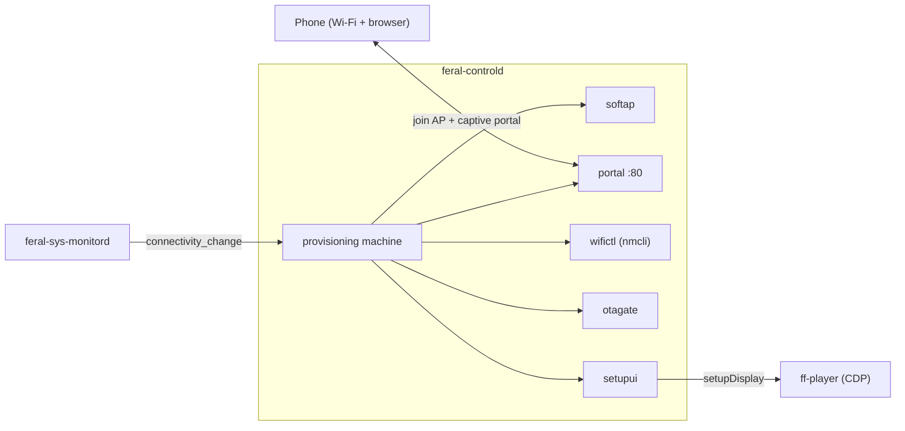
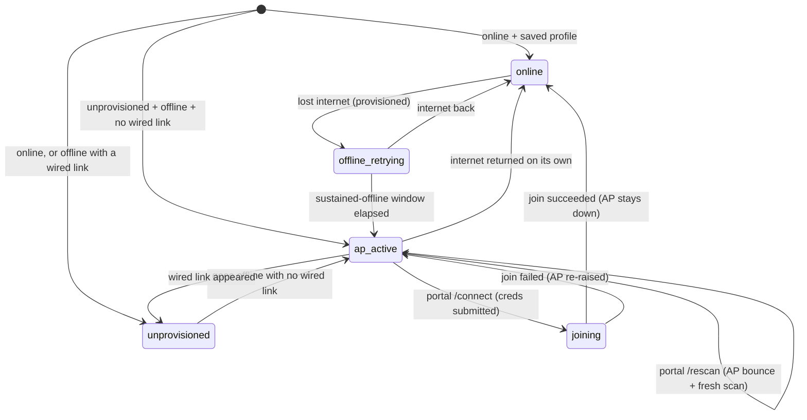

# Device Setup and Recovery Flow

This document describes how `feral-controld` takes a device from cold boot through Wi-Fi provisioning, the OTA gate, claiming, and steady-state playback — and how it re-enters provisioning to recover a device that falls offline. Since the setupd merge, this whole flow lives inside `feral-controld`; there is no separate setup daemon and no BLE channel.

For wire contracts see [`api-design.md`](api-design.md). For service boundaries and the merge rationale see [`architecture.md`](architecture.md). For component-level notes see [`components/feral-controld/AGENTS.md`](../components/feral-controld/AGENTS.md).

---

## Ownership

The setup domain is a set of sub-packages inside `feral-controld`:

| Concern | Package |
|---|---|
| Wi-Fi hotspot (raise/lower) | `softap` |
| Captive portal (HTTP) | `portal` |
| AP trigger + join state machine | `provisioning` |
| `nmcli` scan / join / saved profiles | `wifictl` |
| OTA gate (single-flight, retry, latch) | `otagate` |
| On-screen narration (CDP → ff-player) | `setupui` |
| Claim QR, factory reset, log upload | `devicectl` |

The relayer, `commandrouter`, and CDP forwarding are the runtime side of the same daemon and come up *after* the setup domain.

---

## On-screen narration states (`setupui`)

`setupui` pushes setup progress to the bundled player over the `setupDisplay` CDP contract (manifest-gated, fire-and-forget — see [`architecture.md`](architecture.md)). The states are:

| State | Shown when |
|---|---|
| `scanning` | The pre-AP Wi-Fi scan is running (extension state; players that predate it render nothing). Shown before the first AP raise and during a portal-requested rescan bounce. |
| `softap_qr` | AP is up; the phone should join `FF1-<device_id>` and open the portal. Carries SSID and PSK. |
| `joining` | Credentials submitted; the device is joining the chosen network. |
| `join_failed` | Join failed (wrong password / not found / timeout); AP is being re-raised for a retry. Carries a reason. |
| `updating` | OTA install in progress. Carries progress. |
| `claim_qr` | Provisioned and up to date; showing the `device_connect` claim QR. Carries the URL. |
| `ready` | Pairing confirmed; the player owns the screen. |
| `hidden` | Overlay hidden; normal artwork playback. |
| `factory_reset` | Factory reset staged (extension state, best-effort before reboot). |

There is no durable `setup_phase` state file; these are transient narration intents. The live setup state a LAN client can read is the `provisioning` machine state, exposed as `setup_state` on `GET /api/status`.

---

## The `provisioning` state machine

Machine states: `online`, `offline_retrying`, `unprovisioned`, `ap_active`, `joining`. Transitions are driven by connectivity/link signals from `feral-sys-monitord` (`connectivity_change`) and by portal credential submits.

**Trigger rules:**

- **Unprovisioned + offline + no wired link → raise the AP immediately.** A fresh device with no saved Wi-Fi and no ethernet needs the AP right away.
- **Provisioned + offline → arm a sustained-offline window** (`defaultOfflineWindow = 5m`, re-checked on a `15s` tick). The AP is raised only if the device is still offline when the window elapses, so a brief router reboot never pops the AP over active artwork.
- **A live wired (ethernet) link suppresses the AP** even when the device reports offline. A Wi-Fi link that is up but offline is deliberately *not* suppressed — that is the broken-credentials case the AP exists to fix.
- **Any return to online tears the AP down.**

---

## Cold boot → provisioning → join

### Startup ordering

`feral-controld` brings the LAN hub, mDNS, and the provisioning domain up **before** the relayer/CDP init, and never lets a relayer or CDP failure abort setup (see [`architecture.md`](architecture.md), "The setupd merge"). On a fresh or offline device this means the AP path is available almost immediately, independent of any cloud reachability.

### The AP and captive portal

When the machine enters `ap_active`:

1. `wifictl.RefreshScanCache` runs a live scan **before** the AP goes up (the single radio can't scan and host at once), caching SSIDs for the portal's picker.
2. `softap.Up` raises the NetworkManager hotspot: SSID `FF1-<device_id>`, WPA2-PSK derived from the device id (id itself if ≥ 8 chars, else the id repeated to 8 chars). NM runs DHCP/NAT.
3. The portal starts on `:80`. `setupui` narrates `softap_qr` with the SSID and PSK so the TV shows a join QR.

The phone joins the AP and its OS issues a captive-portal probe (`/generate_204`, `/hotspot-detect.html`, etc.). The portal answers every probe with a `302` to `/` (rather than the 204/success body the OS expects), which makes the OS pop the captive-portal page. The picker lists the cached SSIDs (or a manual SSID field if the scan was empty).

### Join and the AP bounce

On `POST /connect` with `ssid` + `password`, the provisioning machine:

1. Enters `joining`; `setupui` narrates `joining`.
2. Tears the AP **down** (single radio), then runs `wifictl.Join` (`nmcli device wifi connect`).
3. **On success:** transitions to `online`; the AP stays down; the portal reports `/status` → `succeeded`; setup proceeds to the OTA gate and claim QR.
4. **On failure (any class, including wrong password):** re-raises the AP so the user can retry. `wifictl` classifies the failure as auth / SSID-not-found / timeout / unknown; the portal `/status` returns `failed` with that reason, and `setupui` narrates `join_failed` before the AP-up narration re-renders `softap_qr`.

This tear-down-then-rejoin, with a re-raise on failure, is the "AP bounce" the phone experiences: it may briefly lose the AP during the join attempt and re-associate afterward if the join failed.

---

## OTA gate

Once the device is online (whether just provisioned, or booted with a saved profile), setup runs through `otagate` before showing the claim QR.

- **Single-flight** across both entry points via one key (`"ota"`); concurrent callers coalesce onto the in-flight update.
  - `EnsureLatestBeforeClaim` (mode `Required`) is the mandatory pre-claim gate: it updates only if a mandatory/minimum version demands it.
  - `RequestUpdate` (mode `Available`) is the user-triggered `updateToLatestVersion` command: update to any newer version.
- **Always local:** the gate starts the updater systemd unit on-device and tails its log. There is no remote/BLE-triggered path.
- **Version-check ladder:** 3 attempts, fixed 2s wait, 10s per-request cap; a failed check returns `VersionCheckFailed` and does not latch.
- **Update-spawn ladder:** up to 3 attempts, `2^attempt`-second backoff (2s, 4s); a permanent failure (or a transient failure on the last attempt) latches an in-memory permanent-failure state and fires `OnPermanentFailure`. An explicit retry clears the latch. Transient vs. permanent comes from exact-string matching on the `ffos` updater messages.

While an update runs, `setupui` narrates `updating`. A successful update reboots the device, which re-enters this flow from cold boot.

---

## Claim QR → ready

Claiming is driven by the `showPairingQRCode` command:

- **`show=true`:** runs `EnsureLatestBeforeClaim`. Only on `no-update-needed` does it paint the claim QR via `setupui.ShowClaimQR`. If an update starts, the device is too old, or the version check fails, the QR is **withheld** (the narration reflects the update path instead).
- The QR encodes `https://link.feralfile.com/device_connect/<device_id>|<topic_id>|<internet>|<branch>|<version>|pairing` — a pipe-delimited string kept byte-identical to the pre-merge format (see [`api-design.md`](api-design.md)).
- The phone scans it and binds the topic to the user's account via the cloud.
- **`show=false`** (cloud signals pairing ended): `setupui.ShowReady()` is recorded **before** `Hide()`. Pairing confirmation is a durable, one-shot event, so `ready` must register even if the hide is interrupted — hiding first would risk stranding the device in a pairing state while the cloud believes pairing succeeded.

After `ready`/`hidden`, the bundled player owns the screen and normal artwork playback continues.

---

## Offline recovery

A claimed, provisioned device that later loses internet does **not** immediately show the AP. It enters `offline_retrying` and waits out the sustained-offline window (5m). If internet returns first, it goes back to `online` with no visible change. If the window elapses while still offline (and no wired link is present), it raises the AP with reason `sustained-offline` — the same portal path as first-run provisioning — so the owner can re-enter Wi-Fi credentials. The LAN hub listener stays bound throughout (only mDNS discoverability is link-keyed; the listener itself is unconditional), so a LAN client can still reach the device on a working local link even with no internet.

---

## Factory reset

Factory reset (`factoryReset` command) is a security-relevant special case handled in `devicectl`:

1. `feral-controld` clears the persisted relayer topic in-process (`clearPersistedRelayerTopic`), best-effort.
2. It starts `set-factory-boot.service` via `systemctl`, which stages a one-shot boot into the pristine factory btrfs snapshot and reboots.
3. `setupui` narrates `factory_reset` best-effort before the reboot.

The reset **abandons** the running subvolume rather than wiping it: the pristine snapshot becomes the boot target, and the old subvolume (with its now-cleared topic) is left behind. Clearing the topic first closes the window where a resold or interrupted device could remain commandable on the old topic before the reboot completes. On next boot the device comes up fresh and re-enters this flow from cold boot.

---

## Log upload

The `uploadLogs` command zips the device logs and uploads them via a presigned POST to `https://support-logs.feralfile.com/v2/ff1/log-submissions` (which returns a presigned URL), then a PUT of the zip to S3. An optional `supportBundleID` joins FF1 evidence into a support bundle.

---

## Related documents

- [`api-design.md`](api-design.md) — portal endpoints, LAN hub surface, claim QR format, OTA gate contract
- [`architecture.md`](architecture.md) — service boundaries, the setupd merge rationale, the open-LAN surface
- [`components/feral-controld/AGENTS.md`](../components/feral-controld/AGENTS.md) — component contracts and verification commands
